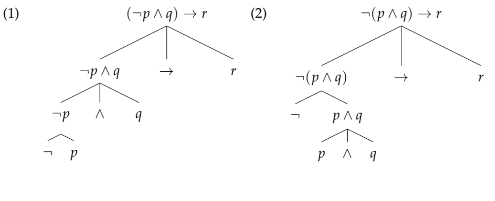
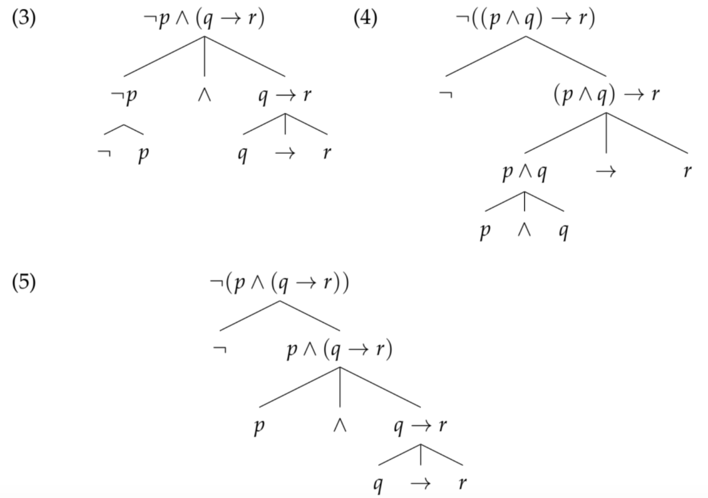

# 大西『論理学』 I部 計算と表現

## 0.まえがき

- 人間の思考について論理の正しさの観点から考える学問
- 現代の論理学は数学的手法で推論を分析=数理論理学という
- 古典論理，非古典論理をやる
- I部をやって，II部はヤバそうなら撤退することもできる
- 一般的に論理学にはモデル論と証明論があるが，この本ではモデル論しかやらない

## 1章 古典命題論理(1)――論理式で計算する

### 1.0 (章のイントロダクション)

- 1章は古典命題論理をやる
- 様々な「〜〜論理」はこれの拡張，改変
- 目標: 概念と議論のしかたになれること
- 導入する概念: 論理式，真理値

### 1.1 論理学の仕事

- 「妥当な推論」ではなく，「妥当な推論の形式」
- 妥当な推論とは？→例として(1)と(2)

- 形式的に妥当とは
- 形式とはp.5右下(番号なし)

### 1.2 古典論理の形式言語

### 1.2.0 (目的)

- 妥当な形式を定めたい
- →「形式言語」を定義する: 推論の形式を明確に表現するための人工言語

#### 1.2.1 語彙と文法

> 定義1: 語彙
>
> - 命題変項: p, q, r……
>   (論理値を持つ，単一の命題を表す。これが最小単位で，その内部構造は無視される。≒自然言語の単文。)
> - 演算子: ¬(否定/not), ∧(連言/and), ∨(選言/or), →(含意/ならば・if……then)

> 定義2: 論理式
>
> 1. 命題変項: p, q, r……は(それぞれが)論理式
> 1. A, Bが論理式ならば
>   ¬A, A∧B, A∨B, A→B
>   は(それぞれが)論理式
> 1. 補助記号(かっこ): (, )

A,B,C……は命題変項だけでなく定義2の2個目の定義のような複合的な論理式を含む，論理式全般を表すときに使う文字。
A→Bには(p→q)→(r→s)のような論理式も当てはまる。

##### 例2 (略)

命題変項p, rは自然言語の1文に対応する。命題が最小単位なので，「命題論理」という。

#### 1.2.2 帰納的定義

定義2-2をくり返し適用することで，より複雑な論理式が形成される(より複雑な記述もも論理式として扱える)

1. 命題変項: p, q, rは論理式
1. 論理式式を演算子でむすんだ¬p, p∧q, p∨r, r→rは論理式
1. 論理式式を演算子でむすんだ¬p, ¬(p∧q), ¬(p∨)r, ¬(r→r), ¬p∧¬p, ¬p∧(p∧q), ¬p∧(p∨r), ¬p∧(r→r),………は論理式

##### 問題1: 命題変項pから3段階目に形成される論理式すべて

定義2-2をひたすら組み合わせる。4×3+4×3×3=48通り？

1. pは論理式
1. ¬p, p∧p, p∨p, p→pは論理式
1. 下記は論理式
    - (¬を使用) ¬¬p, ¬(p∧p), ¬(p∨p), ¬(p→p),
    - (∧を使用)
      - (左辺が¬p) ¬p∧¬p, ¬p∧(p∧p), ¬p∧(p∨p), ¬p∧(p→p)
      - (左辺がp∧p) (p∧p)∧¬p, (p∧p)∧(p∧p), (p∧p)∧(p∨p), (p∧p)∧(p→p)
      - (左辺がp∨p) (p∨p)∧¬p, (p∨p)∧(p∧p), (p∨p)∧(p∨p), (p∨p)∧(p→p)
      - (左辺がp→p) (p→p)∧¬p, (p→p)∧(p∧p), (p→p)∧(p∨p), (p→p)∧(p→p)
    - (∨を使用)
      - (左辺が¬p) ¬p∨¬p, ¬p∨(p∧p), ¬p∨(p∨p), ¬p∨(p→p)
      - (左辺がp∧p) (p∧p)∨¬p, (p∧p)∨(p∧p), (p∧p)∨(p∨p), (p∧p)∨(p→p)
      - (左辺がp∨p) (p∨p)∨¬p, (p∨p)∨(p∧p), (p∨p)∨(p∨p), (p∨p)∨(p→p)
      - (左辺がp→p) (p→p)∨¬p, (p→p)∨(p∧p), (p→p)∨(p∨p), (p→p)∨(p→p)
    - (→を使用)
      - (左辺が¬p) ¬p→¬p, ¬p→(p∧p), ¬p→(p∨p), ¬p→(p→p)
      - (左辺がp∧p) (p∧p)→¬p, (p∧p)→(p∧p), (p∧p)→(p∨p), (p∧p)→(p→p)
      - (左辺がp∨p) (p∨p)→¬p, (p∨p)→(p∧p), (p∨p)→(p∨p), (p∨p)→(p→p)
      - (左辺がp→p) (p→p)→¬p, (p→p)→(p∧p), (p→p)→(p∨p), (p→p)→(p→p)

#### 1.2.3 論理式の構造

- カッコで優先順位を表す
- (¬は優先順位が高い)

- p∧(q∨¬r)の文法的な構造を木で表すと
  - p
  - ∧
  - q∨¬r
    - q
    - ∨
    - ¬r
      - ¬
      - r

```mermaid
graph TD;
    p∧(q∨¬r)-->p;
    p∧(q∨¬r)-->∧;
    p∧(q∨¬r)-->q∨¬r;
    q∨¬r-->q;
    q∨¬r-->∨;
    q∨¬r-->¬r;
    ¬r-->¬;
    ¬r-->r;
```

##### 問題2

(がんばって)

> 定義3:
> ある論理式Aの構造を表す木に登場する論理式(Aを含む)を，Aの部分論理式と呼ぶ。
> Aそれ自身以外の部分論理式(Aを含まない)を，Aの真部分論理式と呼ぶ。

### 1.3 付値・モデル

- 論理式とその値(真理値)
- 複合的な論理式の真理値の計算をする方法

#### 1.3.1 真理値

> 定義4:
>
> - 真理値: 1(真), 0(偽)

- 論理式の「値」:
  - p, q……, A, B……: 命題。自然言語のの文やそれを記号で表したもの
  - 真理値

真理値が完全に一致する命題は同一視できる。

> 定義5: 付値
> 各命題変項に対して1(真)か0(偽)のどちらかを割り当てる関数を，古典命題論理の付値(valuation)ないしモデルと呼ぶ。
> 付値はv, v1, v2などと書く。
>
> - 付値vが命題変項pに1を割り当てるとき: v(p)=1と書く。「pは付値vのもとで真」「pはモデルvにおいて真」と読む。
> - 付値vが命題変項pに0を割り当てるとき: v(p)=0と書く。「pは付値vのもとで偽」「pはモデルvにおいて偽」と読む。

##### 例3: (略)。v1……v4はことなる状況に対応する

v1は世界，状況，文脈のようなものを含む。世界の模型(model)。

> 定義6
> v(¬A)=1 ⇔ v(A)=0
> v(A∧B)=1 ⇔ v(A)=1かつv(B)=1
> v(A∨B)=1 ⇔ v(A)=1またはv(B)=1
> v(A→B)=1 ⇔ v(A)=0またはv(B)=1 ※

※違和感があるかもしれないが，これはあとの章で扱われる。

- 単一の変項からなる付値に分割することで，複合的な論理式に付値を与えることができる。
- 式変形に利用する。

> v(A∨B)=1 ⇔ v(A)=1**または**v(B)=1
の「**または**」について: (v(A),v(B))が(1,0)，(0,1)だけでなく，(1,1)の場合も真になる(非排他的選言という)

《※飯田隆的にいうと，v(A)は文のイミ(Bedeutung)，A自体が文の意義(Sinn)かな？》

#### 1.3.3 論理式の構成にかんする帰納法

定義6をくり返し利用すると，どのような論理式も分解して付値を定義(計算)できる。

##### 問題 3

与えられた論理式をv(p)，v(q)，v(r)に分解してから計算する。

《多分こんな感じかなあ……？　真理値を仮定しないとうまく分解できないので，仮定している。》

(1)
●v(p∧(q∨¬r))=1になると仮定して，分解する。
v(p∧(q∨¬r))=1
⇔v(p)=1かつv(q∨¬r)=1
⇔v(p)=1かつ(v(q)=1またはv(¬r)=1)

一方，問題文からv(r)=1⇔v(¬r)=0なので，v(p)=1，v(q)=0，v(¬r)=0である。

比較すると「v(q)=1またはv(¬r)=1」が成り立たず，「v(p)=1かつ(v(q)=1またはv(¬r)=1)」が成立しない。
仮定と矛盾するので，v(q∨¬r)=1ではない。
v(q∨¬r)=0。

(2): 《略》0

(3)

●v(¬(p∨q)→r)=1
v(¬(p∨q)→r)=1
⇔v(¬(p∨q))=0またはv(r)=1
⇔v(p∨q)=1またはv(r)=1
⇔(v(p)=1またはv(q)=1)またはv(r)=1

問題文からv(p)=1，v(q)=0，v(¬r)=0である。
(v(p)=1またはv(q)=1): 成り立つ。
(v(p)=1またはv(q)=1)v(r)=1: 成り立つ。

v(¬(p∨q)→r)=1。

(4): 《略》 0

### 1.4 ケーススタディ1: 「計算」と「表現」

- 推論を**計算**したい(規則に従った機械的な手続きによって推論したい)
- ブール『論理の数学的分析』(1847)……真理値を代数的に計算する
- すべての推論の妥当性は機械的に判定可能か？
  - 否定的な解決が。古典述語論理の章で扱う

- **表現**:
  - 数式だけでは表現できない命題がある
  - 例: 「どんな数にもそれよりも大きな数が存在する」
    - 「どんな〜にも」「存在する」
    - 量化の表現: フレーゲ『概念記法』(1879)……量化子を発明し，表現力を拡張した

- 計算可能性と表現力のトレードオフ

### 1.5 アクティブラーニング1

《がんばってー》

#### Q1

> 逆行推論は、結論となる事象Bと規則「A→B」から前提となる事象Aを推論する。逆行推論は、演繹法で結論となる事象と前提となる規則とから前提となる規則を導くものである。**この推論は後件肯定の誤謬なので常に正しいとは言えないが**、仮説を作る方法として帰納法とともに重要である。
> なお、論理関係と因果関係は一見似ているが別のものであるので注意したい。思考の前提は事象の原因と異なり、思考の結論は事象の結果と異なる。因果関係がない所に因果関係を見てしまうのは認知バイアスの一つである。例えば、前後即因果の誤謬がある。(「アブダクション」，フリー百科事典『ウィキペディア』)

> v(A→B)=1 ⇔ v(A)=0またはv(B)=1

妥当な推論: v(B)=1であるとき，どのような前提があり得るか。v(A)=1または0。

アブダクション: 何らかの仮説を追加で立てて，v(A)=1かもしれないと推論する？

> ① 毎週金曜日の夕食はカレーである事が分かっている (原理原則)
> ② 今日の夕食はカレーだった (個別事象)
> ③ したがって、今日は金曜日だろう (仮説)
> ((帰納法と演繹法と仮説推論(アブダクション)の違いを具体例で説明～制御工学の基礎あれこれ～)[https://taketake2.com/N104.html])

#### Q2

$$
\frac{△ABCは正三角形である}{△ABCのすべての辺の長さは等しい}
$$

正三角形とは「3本の辺の長さが全て等しい三角形」と定義される。

#### Q3

> p=「ヨシミは東京にいる」
> q=「ヨシミは東京にいる」

v(p)=1かつv(q)=1は不可能。

- v(p)=1かつv(q)=0が不可能なp,qの解釈
- v(p)=0かつv(q)=1は不可能なp,qの解釈: ヨシミは2人いて東京と京都にそれぞれいる場合，当日中に新幹線で移動した場合？
- v(p)=0かつv(q)=0は不可能なp,qの解釈: 東京と京都が同じものを指す場合？

(正解が公開されていない)

## 2 古典命題論理(2)――論理の妥当性

### 2.0 (イントロダクション)

- 推論の妥当性の定義
- 推論の妥当性の機械的な証明方法(アルゴリズム)
- 典型的な法則，誤謬

### 2.1 妥当性

《ここ，非常にヤバいので，定義と例を見比べること》

> 定義1 (妥当性):
>
> $X\cup\{A\}$を古典命題論理の論理式の集合とする。**ある**付値$v$が
$$すべてのB\in{}Xについてv(B)=1, かつv(A)=0$$
を満たすとき，$v$を前提$X$から結論$A$への推論に対する判例モデルと呼ぶ。
> すなわち，**任意の《すべての》**付値$v$について，
$$すべてのB\in{}Xについてv(B)=1ならば, v(A)=1$$
が成り立つとき，前提$X$から結論$A$への推論が**妥当**である，あるいは$X$から$A$が**帰結**すると言い，$X\vDash{}A$と書く。
>
> 推論が妥当ではないとき(反例モデルが存在するとき)は$X\not\vDash{}A$と書く。

- 前提となる論理式の集合$X$と，結論となるひとつの論理式$A$を用いて，古典命題論理の論理式の集合を$X\in{}\{A\}$と書く。
- $\{A\}$は$A$ひとつからなる集合。
- (前提B，結論A)について，v(B)=1と仮定したとき，v(A)=0となるパターンがある場合，推論は妥当ではない。

- $集合\vDash{}要素$，$\{要素,……,要素\}\vDash{}要素$が原則だけど，$要素,……,要素\vDash{}要素$と書くよ

#### 例1

> $$p\rightarrow{}q, q\rightarrow{}r \vDash p\rightarrow{}r$$

が成り立つことを証明する。

- 前提(X): $\{p\rightarrow{}q, q\rightarrow{}r\}$
- 結論(A): $p\rightarrow{}r$

に対応する。

《証明略。》

## 3 様相論理(1)――可能世界意味論
